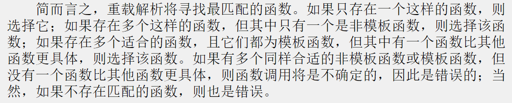

## Chapter Five —— 函数primer
****

C++相比于C提供了函数的一些新特性：
* 内联函数
* 按引用传递变量
* 默认的参数值
* 函数重载
* 模板函数

#### 内联函数
在函数声明前加上关键字 inline
在函数定义前加上关键字 inline

通常的做法是省略原型，将整个定义（即函数头和所有的函数代码）放在本应提供原型的地方。

> 内联函数不支持递归

> 通常，如果一个函数占用多余一行，不用考虑将其作为内联函数

##### 宏与内联函数
inline工具是C++新增的特性，C语言使用预处理器语句#define来提供宏——内联代码的原始实现。
例如，下面是一个计算平方的宏：
```cpp
#define SQUARE(X) X*X
```
这并不是通过传递参数实现的，而是通过文本替换来实现的——X是“参数”的符号标记。

#### 引用变量
C++新增了一个符合变量——引用变量。引用是已定义的变量的别名。

> 引用的底层实现是指针

> 引用的主要作用是用作函数的形参，通过引用变量作用参数，函数将使用**原始数据，而非其副本**
> 这样，除了指针之外，引用也为函数处理大型结构提供里一种非常方便的途径。

> 引用必须在声明时进行初始化，并且无法改变引用指向，这一点类似于const指针

作为函数参数时的示意图：


> 注：
> 在函数参数中使用引用时应尽可能使用**const**
> * 可以避免无意中修改原始数据
> * 使得函数能够处理const和非const实参，否则只能接受非const实参
> * 使用const引用使得函数能够正确生成并使用临时变量

##### 右值引用
C++11 新增了一种引用——右值引用（rvalue reference），这种引用可以指向右值，使用`&&`声明

> 新增右值引用的主要目的是：
> 让库设计人员能够提供有些操作的更有效实现。

##### 何时使用引用参数
* 程序员需要修改调用函数中的数据对象
* 通过传递引用而不是整个数据对象，可以提高程序的运行速度

**一些指导原则：**


#### 默认参数
> 默认参数使得我们能够使用不同数目的参数调用同一个函数

> **注意：**
> 只有函数原型指定了默认值，函数定义与没有默认参数时相同

#### 函数重载
> 函数重载使得我们能够使用多个同名的函数

> 函数重载的关键是函数的参数列表——也成为函数的签名(function signature)
> **函数签名：** 
> * 参数数目
> * 参数类型

> **注意：**
> 使用被重载的函数时，需要在函数调用中使用正确的参数类型：
> ```cpp
> void print(double d, int width); // #1
> void print(long l, int width);   // #2
> void print(int i, int width);    // #3
> // 
> unsigned int year = 3210;
> print(year, 6);              //ambiguous call
> ```
> print()调用无法与任何原型匹配，没有匹配的原型并不会自动停止使用其中某个函数，因为C++有类型转换的机制。如果`#1`是print()的唯一原型，则函数调用print(year,6)将把year转换为double类型。但在上面的代码中，有3个将数字作为第一个参数的原型，因此有3种转换year的方式。在这种情况下，C++将拒绝这种函数调用。并将其视为**错误**！

> 编译器在检查函数签名时，把**类型引用**与**类型本身**视为**同一个签名**：
> ```cpp
> double cube(double x);
> double cube(double & x);
> ```
> 上述两个函数声明并不会被视为函数重载，他们的函数签名一致。

> **const**与**非const**变量可作为函数重载的标签区分

#### 何时使用函数重载
**当函数基本上执行相同的任务，但使用不同形式的数据时，采用函数重载。**

#### 名称修饰
C++通过名称修饰来跟踪每一个重载函数。
例如，我们声明如下一个函数：
```cpp
long MyFunctionFoo(int, float);
```
编译器将其转换为内部表示，也许如下面这样：
```cpp
?MyFunctionFoo@@YAXH
```
将参数数目和类型编码进内部表示，即名称修饰。名称修饰时使用的约定随编译器而异。


#### 函数模板
```cpp
template <typename AnyType>
void Swap(AnyType &a, AnyType &b)
{
    AnyType temp;
    temp = a;
    a = b;
    b = temp;
}
```
第一行指出要建立一个模板，并将类型命名为AnyType
关键字template和typename是必须的
> **注：** typname可由class替换，因为在C98之前，是用class关键字的

> 模板并不创建任何函数，只是告诉编译器如何定义函数。需要一个交换int的Swap函数时，编译器将按模板模式创建这样的函数。使用int代替AnyType


#### 模板重载
当需要多个对不同类型使用同一种算法的函数时，可使用模板
然而，并非所有的数据类型都使用相同的算法，为满足这种需求，引入模板重载。
```cpp
template <typename T>
void Swap(T &a, T &b);

template <typename T>
void Swap(T *a, T *b, int n);
```

##### 模板的局限性
假设有如下模板函数：
```cpp
template <class T>
void f(T a, T b)
{...}
```
下面的语句假设定义了`>`，但如果T为结构类型，该假设不成立：
```cpp
if (a > b)
```
总之，编写的模板函数很可能无法处理某些类型。有两种解决方法：
* 重载运算符
* 为特定类型提供具体化的模板定义

##### 显式具体化与显式实例化
```cpp
template void Swap<int>(int, int);   // 显式实例化，explicit instantiation
template <> void Swap<int>(int &, int &);   // 显式具体化   explicit specialization
template <> void Swap(int &, int &);        // 显式具体化   explicit specialization
```
对于上述代码，显式实例化，会使编译器使用Swap()模板生成一个使用int类型的实例。
显式具体化的意思是：“不要使用Swap()模板生成函数定义，而是用专门为int类型显式地定义的函数定义”
显式具体化声明在关键字template后包含<>, 而显式实例化没有。

> 如果有多个函数原型，编译器在选择原型时，按照如下顺序查找：
> 1. 非模板版本
> 2. 显式具体化
> 3. 模板版本

> **注：**
> 可以在程序中使用函数来创建显式实例化：
> ```cpp
> template <class T>
> T Add(T a, T b)
> {
> return a+ b;
> }
> ...
> int m = 6;
> double x = 10.2;
> cout << Add<double>(x, m) <<endl;   // explicit instantiation
> ```
> 这里的模板与函数调用Add(x,m)不匹配， 因为该模板要求两个函数参数的类型相同。但通过使用Add<double>(x,m),可强制为double类型实例化，并将参数m强制转换为double类型，以便与函数Add<double>(double, double)的第二个参数相匹配。

#### 编译器选择哪个函数版本
**重载解析**


#### decltype
```cpp
template<class T1, class T2>
void ft(T1 x, T2 y)
{
    ...
    ?type? xpy = x + y;
    ...
}
```
在C++ 98中，一个问题是，并非总能知道应在声明中使用哪种类型。
在上例中，T1可能是int，T2可能是double，没有办法知道xpy的类型

> C++11 引入decltype关键字，解决这个问题
```cpp
int x;
decltype(x) y;   // make y the same type as x
```

##### C++11 后置返回类型
```cpp
template<class T1, class T2>
auto gt(T1 x, T2 y) -> decltype(x + y)
{
    ...
    return x + y;
}
```
decltype在参数声明后面，因此x和y位于作用域内，可以使用它们。
auto是一个占位符，表示后置返回类型提供的类型，这是C++11 给auto新增的一种角色。

