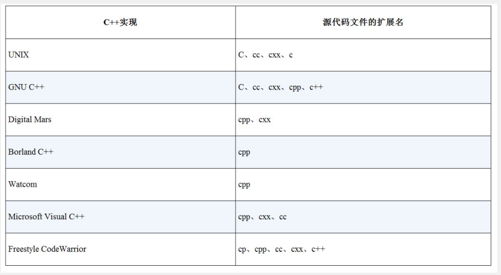

## Chapter One

****

##### C++ 在C 的基础上增加如下特性：
* OOP(面对对象编程)
* 泛型编程

并保留了C的面向过程编程，因而，C++ 是C 的超集
OOP和泛型为C++提供里高级抽象能力，C部分则提供了低级硬件访问能力


##### C++ 版本
从如今（2020）看来，最为广泛流传的是c98/03(99即1998，03则为2003，03没有在98基础上增加新特性，只是进行了修复优化工作), 正在广泛推广的是C11，于2011年推出，增加了很多有趣的新特性。


##### 泛型
所谓泛型，就是创建不依赖于具体类型的代码，如果对不同类型的数据进行排序，不使用泛型的情况下需要对每种类型数据提供一个排序函数，而使用泛型的情况下，只需要编写一个泛型排序函数就可以了。泛型由语言的**模板**特性提供。

##### 后缀名


##### 编译和链接
###### Linux
Linux系统中最常用的编译器是g++, 来自Free Software Foundation的GNU C++ 编译器。

``` cpp
g++ spiffy.cxx
```
有些版本可能要求链接C++库
```cpp
g++ spiffy.cxx -lg++
```
要编译多个源文件，只需要把他们全部放到命令行中即可：
```cpp
g++ my.cxx precious.cxx
```
这将生成一个a.out的可执行文件和两个目标代码文件my.o和precious.o
如果接下来修改了某个源代码文件，如my.cxx，则可以使用my.cxx和precious.o来重新编译。


##### main 函数
一个C++ 程序中必须拥有一个main()函数

C++ 句法要求main()函数的定义以函数头int main()开始
通常，main()函数被启动代码调用，启动代码是由编译器添加到程序中的，是程序和操作系统之间的桥梁。事实上，该函数头描述的是main()函数和操作系统之间的接口。

很多程序使用经典C 函数头：
```cpp
main()
```
在C 语言中，省略返回类型相当于说函数类型为int，然而，C++ 逐步淘汰了这种用法。

也可以使用下面的变体：
```cpp
int main(void)
```
在C++中，在()中使用void关键字等同于让括号空着

有些程序员使用下面的函数头，并省略返回语句：
```cpp
void main()
```
该变体适用于很多系统，但在某些系统上不能工作，因此，应当避免使用这种格式，建议使用C++ 标准格式。

此外，ANSI/ISO C++ 标准做出了一点妥协，如果编译器到达main()函数末尾而没有遇到返回语句，则认为main()函数以如下语句结尾：
```cpp
return 0
```
注：这条隐含语句仅适用于main()函数

注：在Windows编程中，可以编写动态链接库模块（DLL），由于DLL不是独立的程序，因此不需要main()。


##### 注释
应当尽量使用 // 而非C 风格的/* */，因为//不涉及跨行，避免了结尾符号与其实符号的匹配，产生问题的可能性更小。

##### 预处理
C++ 和C 一样，使用一个预处理器，该程序在进行主编译之前对源文件进行处理。不必执行特殊的操作来调用该预处理器，它会在编译程序时自动运行。

```cpp
#include <iostream>
```
该编译指令指示预处理器将iostream文件的内容添加到程序中。实际上，iostream文件的内容将取代程序中的代码行```#include <iostream>```
这是一种典型的预处理器操作：**在源代码被编译之前，替换或添加文本**

##### 头文件
像iostream这样的文件被称为头文件，或是包含文件，C语言传统是使用拓展名`.h`
而在C++中
* 首先，对老式C的头文件保留了拓展名
* 原生C++的头文件则没有拓展名。
* 有些C头文件被转换成C++头文件，这些文件被重新命名：去掉`.h`,加上前缀`c`，如math.h -> cmath

对于纯粹的C++头文件而言，去掉`.h`不只是形式上的变化，没有`.h`的头文件也可以包含名称空间(namespace)

##### 名称空间
如果使用iostream，而不是iostream.h，则可使用下面的名称空间编译指令来使iostream中的定义对程序可用：
```cpp
using namespace std;
```

注：在大型项目中，为了避免名称重叠，应当在`using`编译指令中指明所需的名称，即如下所示：
```cpp
using std::cout;
using std::endl;
using std::cin;
```

***** `endl` 与 `\n`
`endl` 与 `\n`的一个区别是： `endl`会保证程序继续运行前刷新输出（将其立即显示到屏幕上）；而使用`\n`不能提供这种保证，这意味着在某些系统中，有时可能在您输入信息后才会出现提示。


##### 函数定义
C++ 不允许函数嵌套定义

##### 类与对象
类是用户定义的数据类型规范，它详细描述了如何表示信息以及可以对数据执行哪些操作。对象是根据类的规范创建的实体，就像简单变量是根据数据类型描述建立的实体一样。


##### TBC
名称空间与头文件的关系，为啥`include <iostream>`, 使用`iostream`里的函数/对象/类，用的是std名称空间？ 是因为在`iostream`文件里定义了其名称空间为`std`吗？ 编译器看到`std`后，怎么知道`std`空间在哪呢？