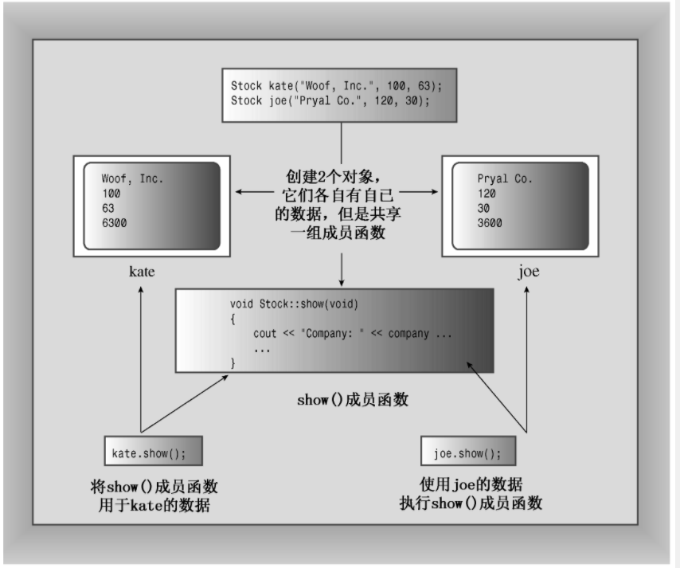

## 类
#### C++ 中的类
类是一种将抽象转换为用户定义类型的C++工具
将数据表示和数据操纵的方法组合成一个整洁的包

#### 类与结构
类结构看上去很像是包含了成员函数以及public和private可见性标签的结构声明。实际上，C++ 对结构进行了扩展，使之具有与类相同的特性。他们之间的唯一区别在于，结构的默认访问类型是public，而类为private。C++ 程序员通常使用类来实现类描述，而把结构限制为只表示纯粹的数据对象（常被称为普通老式数据结构 POD，Plain Old Data）

#### 内联方法
定义位于类声明中的函数都将自动称为内联函数。类声明常将短小的成员函数作为内联函数。
此外，也可以在类声明之外定义成员函数，并使其称为内联函数。只需要在类实现部分中定义函数时使用inline限定符即可。

#### 对象存储
类所创建的每个对象都有自己的存储空间，用于存储其内部变量和类成员。但同一个类的所有对象共享同一组类方法，即每种方法只有一个副本。例如，假设kate和joe都是Stock对象，则kate.shares将占据一个内存块，而joe.shares占用另一个内存块，但kate.show()和joe.show()都将调用同一个方法，也就是说，它们将执行同一个代码块，只是将这些代码用于不同的数据。在OOP中，调用成员函数被称为发送消息，因此将同样的消息发送给两个不同的对象将调用同一个方法，但该方法被用于两个不同的对象。

#### 构造函数和析构函数
> 构造函数没有声明类型：虽然没有返回值，但没有被声明为void类型。
> 构造函数的声明位于公有部分

