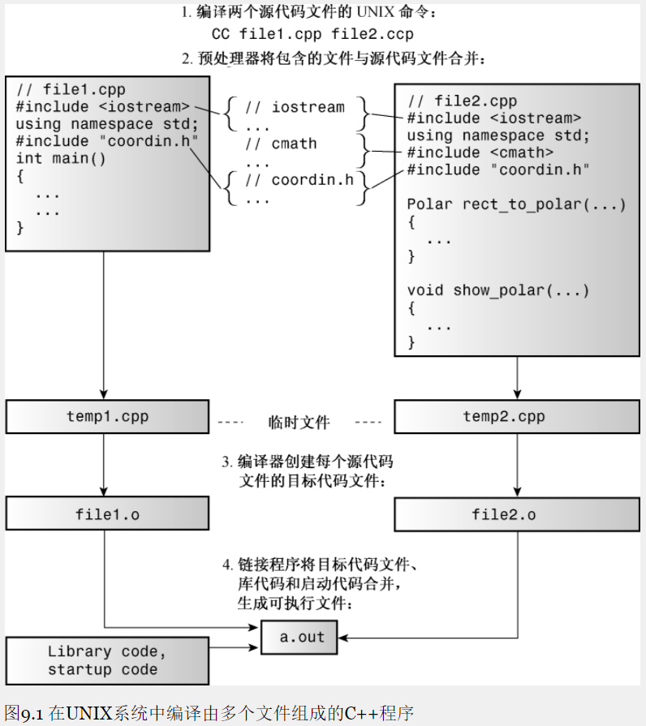
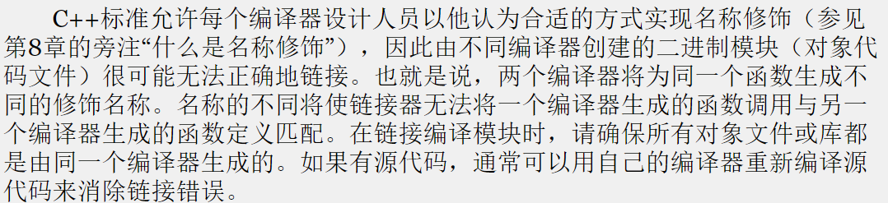
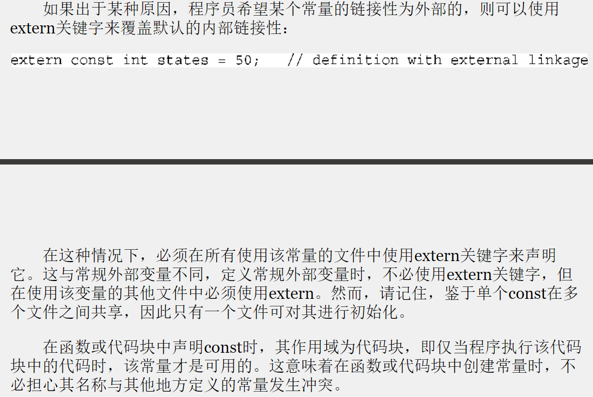
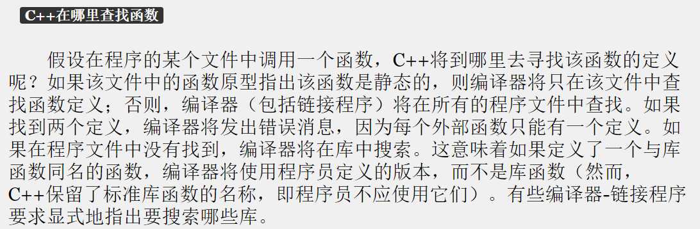

## Chapter Six  —— 内存模型 & 名称空间
****

#### 编译


##### 头文件
头文件中通常包含如下内容：
* 函数原型
* 使用#define或const定义的符号常量
* 结构声明
* 类声明
* 模板生命
* 内联函数

> * 不要将函数定义或变量声明放到头文件中。这样做对于简单情况可能是可行的。但通常会带来麻烦。
> 比如，如果在头文件中包含一个函数定义，然后在其他两个文件中（这两个文件属于同一个程序）包含该头文件，则同一个程序中将包含同一个函数的两个定义，除非函数是内联的，否则这将引起错误。
> * 不要使用#include来包含源代码文件，这样做将导致多重声明。

##### `#ifndef`
> 在同一个文件中只能将同一个头文件包含一次。

记住这个规则很容易，但很可能在不知情的情况下将某个头文件包含多次。例如，可能使用了包含了另一个头文件的头文件。
> 解决方案是： 使用预处理器编译指令 `#ifndef`(if not define)
> 注：这种方法并不能防止编译器将文件内容包含两次，而只是让它忽略除第一次包含之外的所有内容。大多数标准C和C++头文件都使用了这种防护(guarding)方案。否则在同一个文件中定义同一个结构两次，这将导致编译错误。

##### `<>` & `""`
在包含头文件时，如果使用`<>`，则C++编译器将在存储标准头文件的主机系统的文件系统中查找；
如果使用`""`，则编译器将首先查找当前的工作目录或源代码目录（或其他目录，这取决于编译器），如果在那里找不到头文件，则将在标准位置查找。因此在包含自己的头文件时，应使用引号而不是尖括号。

##### 软件里的一些注意事项
> 只需要将源代码文件加入到项目中，而不用加入头文件。

这是因为`#include`指令管理头文件。

##### 多个库的链接


#### extern
对于具有外部链接性的变量，简称为外部变量，它们的存储持续性为静态，作用域为整个文件，可以在其他文件访问。

##### 单定义规则
一方面，在每个使用外部变量的文件中，都必须声明它；另一方面，C++有“单定义规则”，该规则要求变量只能被定义一次。为满足这种需求，C++提供了两种变量声明。
* 定义声明： defining declaration；简称定义
* 引用声明： referencing declaration； 简称声明
> 引用声明不给变量分配存储空间，因为它引用已有的变量。
引用声明使用关键字extern，且不进行初始化；否则，声明变为定义，导致分配存储空间：
```cpp
double up;         // definition, up is 0
extern int blem;   // blem defined elsewhere
extern char gr = 'z' // definition because initialized
```

如果要在多个文件中使用外部变量，只需要在一个文件中包含该变量的定义，但在使用该变量的其他所有文件中，都必须使用关键字extern声明它

##### 作用域解析运算符`::`
当全局变量被局部变量覆盖时，可使用作用域解析运算符得到全局变量
```cpp
cout << "Local warming = " << warming << endl;
cout << "Global warming = " << ::warming << endl;
```

#### 静态局部变量
静态局部变量只会被初始化一次

#### const
在C++中（但不是在C中），const限定符对默认存储类型稍有影响：
在默认情况下，全局变量的链接性是外部的，但const全局变量的链接性是内部的。
```cpp
const int fingers = 10;    // same as static const int fingers = 10;
int main(void)
{...}
```
> 这使得我们可以在头文件中定义const常量，而不会违反单定义规则

##### extern const


#### C++ 查找函数
函数默认是外部链接的，除非声明为static，在原型与定义中都需要使用static关键字。


