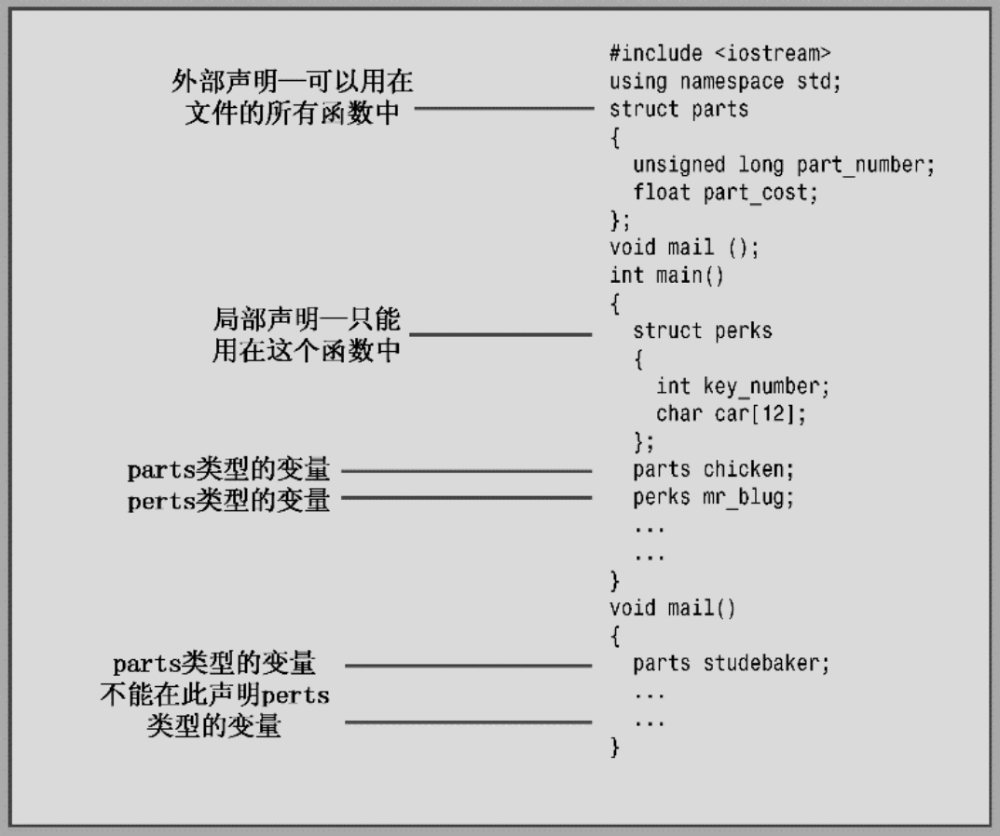
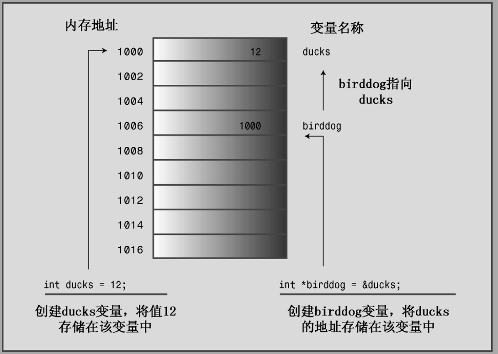

### Chapter Three: 复合类型（类除外）
****

#### 数组
```cpp
typeName arrayName[arraySize]
```
arraySize的值必须是在编译时已知的。即：
* 整型常数（如 10）
* const常量
* 常量表达式（如 8 * sizeof(int))

arraySize的值不能为变量，因为变量的值是在程序运行时设置的，编译时不可知。
> 可以使用`new`来绕开这种限制

> 数组下标
> 编译器不会检查使用的下标是否有效，程序员需要自己进行判断

##### 数组初始化规则
* 只有在定义数组时可以进行初始化，此后不能使用，也不能把一个数组赋给另一个数组
  ```cpp
  int cards[4] = {3, 6, 8, 10};  // okay
  int hand[4];
  hand[4] = {5, 6, 7, 9};        // not allowed
  hand = cards;                  // not allowed
  ```
* 初始化数组时，提供的值可以少于数组的元素数目。如果只对数组的一部分进行初始化，则编译器将其他元素设置为`0`。因而，如果想要把一个数组初始化为全零，可以这么做：
  ```cpp
  long totals[500] = {0};
  ```
* 如果初始化时方括号内(`[]`)为空，C++编译器将自行计算元素个数：
  ```cpp
  short things[] = {1, 5, 3, 8};
  ```
  编译器将使things数组包含4个元素

##### C++11 数组初始化
C++11中将大括号的初始化作为一种通用初始化方式，可用于所有类型。
数组原本就可以使用列表进行初始化，但C++ 中的列表初始化增加了一些功能。
* 初始化数组时，可省略等号（`=`）
* 可不在大括号内包含任何东西，这将把所有元素都设置为零。
* 列表初始化进制缩窄转换
  ```cpp
  long plifs[] = {25, 92, 3.0};                    // not allowed
  char slifs[4] {'h', 'i', 1122011, '\0'};        // not allowed
  char tlifs[4] {'h', 'i', 112, '\0'};            // allowed
  ```

C++ 标准模板库(STL)提供了一种数组替代品——模板类vector, C++11新增了模板类array。这些替代品比内置复合类型数组更复杂、更灵活。

#### 字符串
C++ 处理字符串的方式有两种：
* 来自C 语言的方式，常被称为C-style string
* 基于string 类库的方法
  
##### C-style string
C-风格字符串具有一种特殊的性质：以空字符（null character）结尾，空字符被写作`\0`,其ASCII码为`0`，用来标记字符串的结尾。例如：
```cpp
char dog[8] = {'b', 'e', 'a', 'u', 'x', ' ', 'i', 'I'};    // not a string
char cat[8] = {'f', 'a', 't', 'e', 's', 's', 'a', '\0'};   // a string
```
这两个数组都是char数组，但是只有第二个数组时字符串。
空字符对C-风格字符串而言至关重要。C++中很多处理字符串的函数，会逐个处理字符串中的字符，直到到达空字符位置，如果使用cout显示上面的cat字符串，则将显示前7个字符，发现空字符后停止。但是，如果使用cout显示上面的dog数组，cout将打印出数组中的8个字母，并接着将内存中随后的各个字节解释为要打印的字符，直到遇到空字符为止。

另一种初始化方式如下：
```cpp
char bird[11] = "Mr. Cheeps";  // the \0 is understood
char fish[] = "Bubbles";       // let the compiler count
```
> 用引号括起的字符串隐式地包含结尾的空字符，因此不用显式地包含它。
> 各种C++输入工具通过键盘输入，将字符串读入到char数组中时，将自动加上结尾的空字符。
> **注意：**
> 字符串常量与字符常量不同，字符常量时字符编码地简写表示，在ASCII系统上，‘S’只是83地另一种写法。
> 但是，"S"不是字符常量，它表示地时两个字符（字符`S`和`\0`)组成的字符串。
> "S"实际上表示的是字符串所在的内存地址。


##### 拼接字符串常量
C++ 允许拼接字符串字面值，任何两个由空白（空白：空格、制表符、换行符）分隔的字符串常量都将自动拼接成一个。下面三条输出语句是等效的：
```cpp
cout << "I'd give my right arm to be" " a great violinist.\n";
cout << "I'd give my right arm to be a great violinist.\n";
cout << "I'd give my right ar"
"m to be a great violinist.\n";
```

#### cin
cin 读取输入的时候，默认以空白作为分隔
有时，我们需要读取一行，cin提供了面向行的类成员函数getline()和get()
这两个函数都读取一行输入，直到到达换行符。
区别在于，getline()将丢弃换行符，而get()将换行符保留在输入序列中。


#### sting 类
ISO/ANSI C++98 标准通过添加string类拓展了C++库，现在可以使用string类型的变量（使用C++ 的话说是对象）而不是字符数组来存储字符串。
string类用起来比数组简单，同时提供了将字符串作为一种数据类型的表示方法。

使用string类，需要在程序中包含头文件string。
string类位于名称空间std中，因此需要提供一条using编译指令，或者使用std::string来引用它。

> string 对象无法通过cin.getline()函数获取输入的一行字符串，而需要采用getline(cin, strName)的方式。
> 原始字符串： `R"+*()+*"`, 括号里的字符串会被当做原始字符串，类似python里的`r""`


#### 结构 struct
C++ 中声明一个结构后，在创建变量时，允许省略`struct`关键字，这一点与C 语言不同

声明的位置：


> C++结构除了可以具有成员变量外，还可以具有成员函数，这一点与C 语言不同。

#### 共用体 union
共用体可以存储不同的数据结构，但是同一时间只能存储其中的一种类型，句法与结构体相似，但是含义不同。
```cpp
union one4all
{
    int int_val;
    long long_val;
    double double_val;
}
```
可以使用one4all存储int，long，或double，条件是在不同的时间进行。
```cpp
one4all pail;
pail.int_val = 15;         // store an int
cout << pail.int_val;
pail.double_val = 1.38;    // store a double, int_val is lost
cout << pail.double_val
```
由于共用体每次只能存储一个值，因此它必须有足够的空间来存储最大的成员，所以，共用体的长度为其最大的成员的长度。

> 共用体常用于（当然并非只能用于）节省内存（对于嵌入式系统编程而言）, 另外，共用体常用于操作系统数据结构或硬件数据结构。

#### 枚举
C++ 的enum工具提供了另一种创建符号常量的方式，这种方式可以替代const。
它还允许定义新类型。
句法与struct类似

```cpp
enum spectrum {red, orange, yellow, green, blue, violet, indigo, ultraviolet};
```
spectrum成为新类型的名称；spectrum被称为枚举（enumeration）
red, orange, yellow等作为符号常量。
默认情况下，会将整数值赋给枚举量，第一个枚举量的值为`0`，第二个枚举量值为`1`。
可以显式地指定整数值来覆盖默认值。

> 枚举常用来定义相关地符号常量，而不是新类型
> 如果只打算使用常量，而不创建枚举类型地变量，可以省略枚举类型地名称，如下所示
> ```cpp
> enum {red, oragne, yellow};
> ```

##### 设置枚举类型地值
可以适用赋值运算符显式地设置枚举量地值：
```cpp
enum bits {one = 1, two = 2};
```
指定的值必须是整数
也可以只显式定义其中一些枚举量的值：
```cpp
enum bigstep{first, second = 100, third};
```
这里，first的默认情况下为`0`, 后面没有被初始化的枚举量将比前面的枚举量大`1`， 因此，third的值为`101`
最后，可以创建多个值相同的枚举量：
```cpp
enum {zero, null = 0, one, numero_uno = 1};
```
其中，zero, null都为`0`, one, numero_uno都为`1`

> 在C++ 早期版本中，只能将int值（或提升为int的值）赋给枚举量，但这种限制现在取消了，因此可以使用long甚至long long类型的值

##### 枚举的取值范围
C++现在通过强制类型转换，增加了可赋给枚举变量的合法值，每个枚举都有取值范围。
```cpp
enum bits{one = 1, two = 2, eight = 8};
bits myflag;
myflag = bits(6);         // valid , because 6 is in bits range
```
取值范围定义如下：
* 上限：找到枚举量最大值，求出大于这个最大值的最小的2的幂，将它减去1.
  如：最大枚举值为101， 2的幂中，比这个数大的最小值为128， 因此取值范围的上限为127
* 下限：找到枚举量的最小值，如果其大于零，下限为0。否则，采用与寻找上限方式相同的方法，但是加上符号，即可。

> C++11 扩展了枚举，增加了作用域内枚举

#### 指针
计算机程序存储数据必须跟踪三种属性：
* 信息存储在何处
* 存储的值是多少
* 存储的信息是什么类型

`指针`是一个变量，用来存储值的地址，而不是值本身。
获取变量的地址，使用取地址符`&`

指针示意图：


> * 两边的空格是可选的
> C程序员习惯使用 `int *ptr`的格式，强调`*ptr`是一个`int`类型的值
> C++程序员习惯于使用 `int* ptr`的格式，强调`int*` 是一种类型——指向`int`的指针
> 你甚至可以使用这样的格式： `int*ptr`

> **注意：**
> 下面的声明创建一个指针(p1)和一个int变量(p2):
> ```cpp
> int* p1, p2;
> ```
> 对每个指针变量名，都需要使用一个`*`

> **注意：**
> 在C++ 中创建指针时，计算机将分配用来存储地址的内存，但不会分配用来存储指针所指向的数据的内存。

##### 指针与数字
指针不是整型，虽然计算机通常把地址当作整数来处理。
在C99标准发布之前，C语言允许如下赋值：
```cpp
int* pt;
pt = 0xB8000000;
```
但C++在类型一致上的要求更加严格，编译器将显示一条错误信息，通告类型不匹配。
要把数字值当作地址来使用，需要强制类型转换：
```cpp
int* pt;
pt = (int*) 0xB8000000;
```

#### new, delete
指针配合new可以在程序运行时分配内存空间。
变量声明是在编译时分配空间，存储在栈中。
new分配的内存存放在堆中（自由存储区）

关于delete:
* 不要重复delete一个已经释放的内存块，这样做的结果将是不确定的
* 不能使用delete来释放通过声明变量的方式所获得的内存
* delete释放指针指向的地址，但是指针本身会保留，可以将该指针再次指向其他地址
* 对空指针应用delete是安全的


```cpp
int jugs = 5;
int* pi = &jugs;
delete pi;             // not allowed, memory not allocated by new
```

##### 使用new创建动态数组
```cpp
int* psome = new int [10]; // get a block of 10 ints
```
new 运算符返回第一个元素的地址。

> 当程序使用完new分配的内存块时，应当使用delete释放它们。
> 对于使用new创建的数组，应当使用另一种格式的delete来释放：
> ```cpp
> delete [] psome;
> ```
> 方括号告诉程序，应当释放整个数组，而非仅仅是指针指向的元素。

##### 数组名
* 在多数情况下，C++将数组名视为数组的第一个元素的地址。
* 一种例外情况是，将sizeof运算符用于数组名时，此时将返回整个数组的长度(单位为字节)

