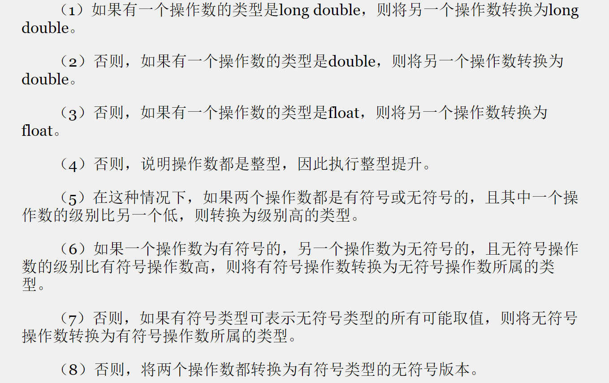

## Chapter Two
****

### 数据类型
#### C++ 内置的数据类型
C++内置的数据类型分两种：
* 基本类型
  * 整型
    * unsigned long
    * long
    * unsigned int
    * int
    * unsigned short
    * short
    * char
    * unsigned char
    * signed char
    * bool
    * unsigned long long
    * long long
  * 浮点型
    * float
    * double
    * long double
* 复合类型
  * 数组
  * 字符串
  * 指针
  * 结构

**面对对象编程的本质是设计并拓展自己的数据类型，设计自己的数据类型就是让类型与数据匹配。**

##### 变量命名
遵循如下规则：
* 区分大小写
* 只能包含字母字符，数字和下划线(_)
* 名称的第一个字符不能为数字
* 不能使用C++ 关键字
* 以两个下划线开头或是一个下划线和大写字母组合开头的名称保留给实现（编译器及其使用的资源）使用。
* 以一个下划线开头的名称被保留给实现，用作全局标识符。

注：C++ 对于名称的长度没有限制，但是有些平台有长度限制。

注：使用像是`_time_stop`或是`_Donut`这样的名称不会导致编译器错误，因为它门符合编译器要求，但是可能会导致行为的不确定性。

注： 在ANSI C（C99标准）中，只有名称的前63个字符有意义，在ANSI C中，前63个字符相同的名称被认为是相同的。

#### 整型
##### 位宽
C++ 提供了一种灵活的标准，它确保了最小长度(从C语言借鉴而来),如下所示：
* short 至少16位
* int 至少与short 一样长
* long 至少32位，且至少与int 一样长
* long long至少64位，且至少与long一样长
可以借助sizeof运算符来查看类型位宽
```cpp
sizeof (int);

int a = 20;
sizeof a
```

##### climits
头文件climits定义了符号常量来表示类型限制,climits文件由编译器厂商提供，该文件指出其编译器中的值。
在64位windows操作系统中，`INT_MAX`值为`2 147 483 647`(4个字节)
而在一些16位`int`的老系统中，climits文件将`INT_MAX`定义为`32 767`

climits文件中包含与下面类似的语句行：
```cpp
#define INT_MAX 2 147 483 647
```
在C++ 编译过程中，先将源代码传递给预处理器，`#define`与`#include`一样，是一个预处理器编译指令。预处理器会查找`INT_MAX`，并将其替换为`2 147 483 647`
`#define`指令的工作方式类似于文本编辑器中的全局搜索并替换命令。
我们可以使用`#define`来定义自己的符号常量，但C++ 有一种更好的方式（使用关键字`const`）。
然而，有些头文件，尤其是被设计为可用于C和C++中的头文件，必须使用`#define`

##### 初始化
在变量声明时对其进行赋值，称为初始化
C++ 相比于C 增加了一种变量初始化方法，如下：
```cpp
int wrens(432); // set wrens to 432
```
注：如果知道变量的初始值，我们建议对其进行初始化，避免之后忘记赋值，也使得阅读程序更加顺畅。

##### C++11 初始化方式
还有一种初始化方式，这种方式用于数组和结构体，但在C++98中，也可用于单值变量:
```cpp
int hamburgers = {24}; // set hamburgers to 24
```
将大括号初始化器用于单值变量的情形还不多，但C++11 标准使得这种情况更多了。
首先，使用这种方式，可以使用等号，也可以不使用：
```cpp
int emus{7};         // set emus to 7
int rheas = {12};    // set rheas to 12
```
其次，大括号内可以不包含任何东西，这种情况下，变量将被初始化为零：
```cpp
int rocs = {};
int psychics{};
```
第三，这有助于更好地防范类型转换错误

使用大括号进行初始化，使得初始化常规变量的方式与初始化类变量的方式更像。C++11使得可将大括号初始化器用于任何类型，这是一种通用的初始化语法。

##### unsigned
注： unsigned本身是unsigned int的缩写

##### 选择整型类型
C++提供了大量的整型类型，通常，`int`被设置为对目标计算机而言最为“自然”的长度，自然长度（natural size)指计算机处理起来效率最高的长度。如果没有其他理由，则应当选择使用`int`

##### 进制
```cpp
using std::cout;
using std::endl;
using std::oct;
using std::hex;
using std::dec;

cout << oct; // 不会输出任何字符，但是接下来调用cout，输出整数会呈现为8进制显示
cout << hex; // 不会输出任何字符，但是接下来调用cout，输出整数会呈现为16进制显示
cout << dec; // 不会输出任何字符，但是接下来调用cout，输出整数会呈现为10进制显示
// 在下一次修改格式之前，cout将保持上一次修改的格式
```

##### signed char & unsigned char
与int不同，char在默认情况下既不是没有符号，也不是有符号。是否有符号由C++实现来决定，这样编译器开发人员可以最大限度地将这种类型与硬件属性匹配起来。
```cpp
char fodo;       // may be signed, may be unsigned
unsigned char bar;  // definitely unsigned
signed char snark;  // definitely signed
```

##### C++11 新增char16_t 和 char32_t
二者均为无符号类型，前者16bit，后者32bit。
C++使用前缀`u`表示char16_t字符常量和字符串常量，如`u'C'`和`u"be good"`
使用前缀`U`表示char32_t常量，如`U'R'`和`U"dirty rat"`
类型char16_t与`/u00F6`形式的通用字符名匹配（Unicode）
类型char32_t与`/U0000222B`形式的通用字符串名匹配。
与C++98中`wchar_t`一样，char16_t和char32_t也都有底层类型——一种内置的整型类型，但底层类型可能会随系统不同而不同。

##### bool
ANSI/ISO C++ 标准添加了一种名为bool的新类型，名称源于英国数学家George Boole.
过去，C++与C一样，没有布尔类型，将非零值解释为true，零值解释为false。
引入bool类型后，分别用预定义的字面值true和false表示逻辑真伪：
```cpp
bool is_ready = true;
```
字面值true和false都可以通过提升转换为int类型，true转换为1，false转换为0：
```cpp
int ans = true;           // ans assigned 1
int promise = false;      // promise assigned 0
```
此外，任何数字值或指针值都可以被隐式转换为bool值，任何非零值都被转换为true，而零被转换为false：
```cpp
bool start = -100;       // start assigned true 
bool stop = 0;           // stop assigned faslse
```

##### const
const 用于定义符号常量，优于 `#define`方式
```cpp
const int Months = 12;   // Months is symbolic constant for 12
```
这样，便可以在程序中使用Months，而不是`12`了。常量被初始化后，其值就固定了，编译器不允许再修改该常量的值。
const被称为`限定符`，因为它限定了声明的含义。

一些常用做法：
* 将名称首字母大写，以提醒Months是个常量
* 将整个名称大写，常见于使用`#define`创建常量的情况
* 以字母`k`打头，如`kmonths`

> 注: 如果在声明常量时没有进行初始化，则该常量的值是不确定的，且无法修改
> **const的优点：**
> * 能够明确指定类型
> * 可以利用C++ 作用域规则将常量定义限制在特定的函数或文件中
> * 可以将const用于更加复杂的类型，如数组，结构体等

#### 浮点数
C++ 中有float，double，long float三种浮点数类型。
一般，float 32bit, double 64bit, long double 80/96/128bit
，即变量的类型可能无法表示赋给它的值，此时会引起编译器报错。

这三种类型的指数范围至少是-37到37
可以从头文件`cfloat`中找到系统的限制。

##### C++11  以`{}`方式初始化时的转换
在赋值时存在类型转换的情况，类型转换可能会带来数据转换错误，比如将float转换为short，
使用`{}`进行赋值，不允许缩窄（narrowing），即变量的类型可能无法表示赋给它的值，此时会引起编译器报错。

##### 表达式中的类型转换

第四点，举例如下：
```cpp
short chickens = 20;
short ducks = 35;
short fowl = chickens + ducks;
```
为执行第三行语句，C++程序取得chickens和ducks的值，并将它们转换为int，然后将计算结果转换为short。
因为，通常将int类型选择为计算机最自然的类型，计算机使用这种类型时，运算速度可能最快。
这种做法称为`整数提升`。

##### 强制类型转换
```cpp
(typename) value;     // C style
typename (value);     // C++ style
```
C++ 中还引入了4个强制类型转换运算符：
```cpp
static_cast<typeName> (value);

int thron = 32;
static_cast<long> (thron);
```
运算符static_cast<>运算符比传统的强制类型转换更加严格。

##### auto声明
这是C++ 11新增的工具，让编译器能够根据初始值的类型推断变量的类型。为此，它重新定义了auto的含义。
auto是一个C语言关键字，但很少使用。
在初始化声明中，如果使用关键字auto，而不指定变量的类型，编译器将把变量的类型设置成与初始值相同。

在处理复杂类型，如标准模板库(STL)中的类型时，自动类型推断(auto)的优势才能显现出来，如下：
C++98代码：
```cpp
std::vector<double> scores;
std::vector<double>::iterator pv = scores.begin();
```
C++11 允许重写为如下这样：
```cpp
std::vector<double> scores;
auto pv = scores.begin();
```
